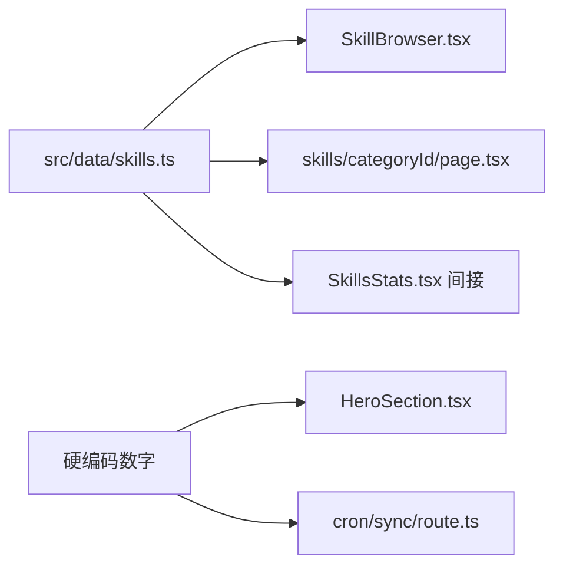

## 用户需求

将上一轮对话中关于技能、教程、博客三大板块的内容审计和补充建议，沉淀到项目文档中作为内容规划路线图，然后按优先级从第一个任务开始执行。

## 产品概述

为 OpenClaw101 学习资源中心建立内容补充计划文档，并执行第一项任务 -- 为技能板块补充缺失的分类和技能数据。

## 核心功能

1. 在项目中创建内容规划文档 `CONTENT_ROADMAP.md`，记录三大板块的现状盘点和待补充清单
2. 为技能板块新增 5 个缺失分类（数据与数据库、文件与文档、视频与媒体、日历与任务管理、金融与加密），每个分类包含 4-6 个具体技能
3. 更新所有引用技能总数的页面组件，使数字与实际数据保持一致
4. 更新 progress.json 记录本次会话

## 技术栈

- Next.js 16 + React 19 + TypeScript 5 (strict)
- Tailwind CSS v4 + Framer Motion 12
- next-intl 4 (en/zh 双语)
- 纯静态数据架构，数据文件位于 `src/data/`

## 实现方案

本次任务分为两部分：文档沉淀 + 技能数据补充。

**文档沉淀**：在项目根目录创建 `CONTENT_ROADMAP.md`，按优先级记录三大板块的待办事项清单。这是纯文档任务，不影响代码。

**技能数据补充**：在 `src/data/skills.ts` 中新增 5 个分类和对应的技能条目。关键约束：

- 新技能的 `id` 从 `'73'` 开始递增（当前最大 id 为 `'72'`）
- 每个分类的 `count` 字段必须精确等于该分类下 `sampleSkills` 中的实际条目数
- 新分类的 `id` 必须全局唯一，使用 kebab-case
- 所有分类需包含 `name`、`nameZh`、`icon`、`count`、`description`、`descriptionZh` 六个字段

**数据一致性同步**：新增分类后需同步更新以下位置的硬编码数字：

- `src/components/home/HeroSection.tsx` 中的 `72 Skills` 改为新总数
- `src/components/home/SkillsStats.tsx` 中的 `totalSkills = 72` 改为新总数
- `src/app/api/cron/sync/route.ts` 中的 `totalSkills: 72` 和 `categories: 12` 改为新值

## 实现注意事项

- `SkillBrowser.tsx` 的 totalSkills 是通过 `skillCategories.reduce` 动态计算的，无需手动修改
- `SkillsStats.tsx` 中存在一个本地 `skillCategories` 数组（与 data/skills.ts 中的不同），仅渲染前 8 个分类的 count 值用于首页展示，新增分类可不加入此处，但需更新 totalSkills 常量
- `generateStaticParams` 在 `skills/[categoryId]/page.tsx` 中会自动遍历 `skillCategories`，新分类会自动生成对应页面
- 不需要修改 i18n 翻译文件 -- 技能数据使用内联的双语字段（name/nameZh, description/descriptionZh）

## 架构设计

数据流方向：



新增数据只需修改 `skills.ts` 一个数据源文件。其他文件仅需更新硬编码数字常量。

## 目录结构

```
project-root/
├── CONTENT_ROADMAP.md                        # [NEW] 三大板块内容补充规划路线图，按优先级排列所有待办任务
├── src/
│   ├── data/
│   │   └── skills.ts                         # [MODIFY] 新增 5 个分类（data/finance/media/productivity/docs）+ 约 25 个技能条目，id 从 73 开始
│   ├── components/
│   │   └── home/
│   │       ├── HeroSection.tsx               # [MODIFY] 将 "72 Skills" 更新为新总数（约 97）
│   │       └── SkillsStats.tsx               # [MODIFY] 将 totalSkills = 72 更新为新总数
│   └── app/
│       └── api/
│           └── cron/sync/route.ts            # [MODIFY] 更新 totalSkills 和 categories 的 fallback 值
├── progress.json                             # [MODIFY] 新增 S005 会话记录
└── feature_list.json                         # [MODIFY] 新增 F021 内容补充功能条目
```

## Agent Extensions

### SubAgent

- **code-explorer**
- 目的：在执行阶段如需确认其他组件是否引用了技能总数的硬编码数字，使用此子代理进行跨文件搜索
- 预期结果：精确定位所有需要同步更新的硬编码位置，避免遗漏