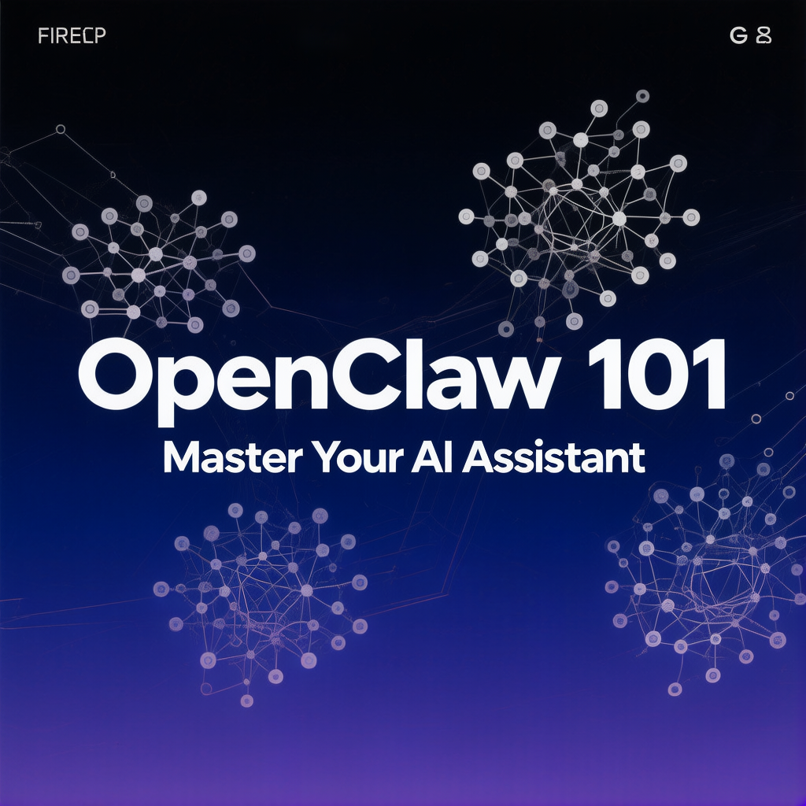

# OpenClaw 101

> The independent, bilingual learning hub for [OpenClaw](https://openclaw.ai) — the open-source AI agent platform.

[](https://openclaw101.vip)
[](https://vercel.com/new/clone?repository-url=https://github.com/moonye6/openclaw101)
[](#-license)
[](https://nextjs.org)

**Live site:** https://openclaw101.vip

<p align="center">
  
</p>

## Why this exists

The official OpenClaw docs explain *what each command does*. This site explains *what to actually build* — with full walkthroughs in English and 中文, opinionated comparisons against alternatives (LangChain, Cursor, Claude Code, ChatGPT), and content tested against real beginner pain points (env setup, error messages, channel auth flows).

If you're trying to:

- Get a working **Telegram / QQ / Discord bot** in 10 minutes
- Decide whether OpenClaw fits your stack vs. **LangChain / Cursor / Claude Code**
- Avoid the install errors that everyone hits but nobody documents
- Learn the platform from zero in a structured **7-day path**
- Find the right **skill** for your use case across 17 categories

…this is built for you.

## What's inside

| | Count | Where |
|---|---|---|
| In-depth articles | **42** | `/blog` — install, troubleshooting, comparisons, channel guides, automation patterns |
| Curated tutorials | **69** | `/tutorials` — links to official docs, cloud platforms, community write-ups |
| Skill categories | **17** | `/skills` — AI/LLM, DevOps, Research, Coding, Comms, Data, more |
| Real-world skills | **114** | sampled across the 17 categories |
| Use-case deep dives | **6** | `/use-cases` — coding, research, automation, content, smart home, data |
| Day-by-day learning path | **7** | `/learn/1` through `/learn/7` |
| Languages | **EN + 中文** | full i18n via `next-intl` |

All content is independent — not affiliated with the official OpenClaw team.

## 🌟 Highlights — the pages worth bookmarking

If you're new and want to see what's good:

- 📘 [Complete Telegram bot tutorial (10 min, zero code)](https://openclaw101.vip/blog/how-to-create-telegram-bot)
- 🏗️ [How to install OpenClaw on Mac / Linux / Windows (2026)](https://openclaw101.vip/blog/how-to-install-openclaw)
- 🔌 [QQ Bot native integration walkthrough (v2026.3.31)](https://openclaw101.vip/blog/openclaw-qq-bot-native-integration)
- ⚖️ [OpenClaw vs LangChain — when to use which](https://openclaw101.vip/blog/openclaw-vs-langchain)
- 💰 [Is OpenClaw really free? Full pricing breakdown](https://openclaw101.vip/blog/is-openclaw-free-pricing-guide)
- 🛠️ [Most common OpenClaw errors + fixes](https://openclaw101.vip/blog/openclaw-common-errors)

## 🧱 Stack

| Layer | Tool |
|-------|------|
| Framework | Next.js 16 (App Router, ISR) |
| UI | React 19 + Tailwind CSS v4 + Framer Motion 12 |
| Language | TypeScript 5 (strict) |
| i18n | next-intl 4 |
| Testing | Playwright (E2E + smoke) |
| Deploy | Vercel |
| Package Manager | pnpm 9+ |

## 🚀 Run locally

```bash
git clone https://github.com/moonye6/openclaw101.git
cd openclaw101
pnpm install
cp .env.example .env.local           # fill in CRON_SECRET (any random string for local)
pnpm dev                              # → http://localhost:3000
```

### Build, lint, validate

```bash
pnpm build                # production build
pnpm lint                 # ESLint
pnpm validate             # typecheck + lint + structure + dead-link guard + blog checks
pnpm test:e2e             # Playwright E2E
```

### SEO tooling

```bash
pnpm audit:inbound-links            # scan internal /blog/<slug> link density
pnpm audit:inbound-links:gate       # CI strict mode (exit 1 if any post < 5 inbound)
pnpm sync:gsc                       # pull Google Search Console weekly report (see docs/seo/gsc-setup.md)
```

## 📁 Layout

```
src/
├── app/[locale]/        # i18n-aware Next.js App Router (en + zh)
├── data/blog/           # 42 in-house blog posts (typed)
├── data/                # tutorials, skills, use-cases, learning-path
├── components/          # home/, layout/, seo/, skills/, tutorials/, ui/
├── i18n/                # en.json, zh.json, routing, valid-params
└── middleware.ts        # 301 redirects + 404 enforcement for unknown dynamic params
```

## ⚙️ Environment variables

See [`.env.example`](.env.example) for the full list.

| Variable | Required | Purpose |
|---|---|---|
| `CRON_SECRET` | yes | Auth for `/api/cron/sync` |
| `BASE_URL` | no | Override base URL for RSS / canonical generation |
| `NEXT_PUBLIC_GA_ID` | no | GA4 measurement ID override |
| `GSC_SERVICE_ACCOUNT_KEY_PATH` | no | Path to GSC service-account JSON (for `pnpm sync:gsc`) |
| `GSC_SITE_URL` | no | GSC property identifier (e.g. `sc-domain:openclaw101.vip`) |

## 🤝 Contributing

PRs welcome — especially:

- New blog posts on under-covered topics (production scaling, edge cases, real failure stories)
- Translations / localization improvements
- Skill category curation
- Bug reports against the live site

Read [`AGENTS.md`](AGENTS.md) for development conventions and testing rules.

## 📄 License

[MIT](LICENSE)

---

**Found a bug? Want a topic covered?** Open an issue or DM the maintainer. The site is small enough that real feedback shapes the roadmap.
